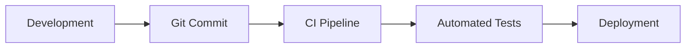

# Technology Stack: Slidev Educational Presentation Enhancement

**Project:** DevOps Introduction Presentation
**Researched:** 2026-02-02
**Context:** Expanding existing Slidev 0.50.0-beta.7 presentation from ~40 slides to ~1h30 of content with enhanced educational features

## Research Limitations

**IMPORTANT:** This research is based on my training knowledge (cut-off January 2025) without verification from Context7, WebSearch, or official documentation due to access restrictions. All recommendations should be considered **MEDIUM-LOW confidence** and verified against current official Slidev documentation at https://sli.dev/ before implementation.

## Recommended Stack

### Core Framework
| Technology | Version | Purpose | Why |
|------------|---------|---------|-----|
| @slidev/cli | ^0.50.0-beta.7 (current) | Presentation framework | Already in use, modern beta with latest features |
| Vue | ^3.5.13 (current) | Component framework | Required by Slidev, already configured, enables custom interactive components |
| @slidev/theme-default | latest (current) | Base theme | Currently in use, provides solid foundation |

**Recommendation:** Keep current versions. The beta version 0.50.x includes modern features like MDC syntax which is already enabled.

### Interactive & Educational Addons

| Addon | Version | Purpose | Confidence | Why |
|-------|---------|---------|------------|-----|
| slidev-addon-qrcode | ^1.0.2 (current) | QR code generation | HIGH | Already installed, useful for resource sharing |
| slidev-addon-excalidraw | latest | Interactive diagrams | MEDIUM | Enables drawing/sketching during presentation, great for DevOps architecture diagrams |
| slidev-addon-quiz | latest | Quiz components | LOW | May exist - needs verification. Alternative: custom Vue components |
| slidev-addon-poll | latest | Live polling | LOW | May exist - needs verification for audience interaction |

**Note:** The Slidev addon ecosystem is community-driven. Many "quiz" or "poll" addons may not exist as official packages. Custom Vue components are the primary recommendation for interactive features.

### Code Highlighting & Display

| Technology | Included | Purpose | Why |
|------------|----------|---------|-----|
| Shiki | Built-in to Slidev | Syntax highlighting | VS Code quality highlighting, extensive language support including YAML, Dockerfile, Shell for DevOps content |
| Monaco Editor | Available via config | In-slide code editing | Enables live code demonstrations and interactive coding examples |
| Code Line Highlighting | Built-in | Focus on specific code lines | Essential for step-by-step code explanations |

**Configuration approach:**
- Use Shiki's built-in syntax highlighting with language tags in code blocks
- Enable line highlighting with `{1,3-5}` syntax
- Configure Monaco for interactive demos if needed

### Styling & Theming

| Technology | Version | Purpose | Why |
|------------|---------|---------|-----|
| UnoCSS | Built-in to Slidev | Utility-first CSS | Slidev uses UnoCSS by default, enables rapid styling without CSS files |
| Scoped styles | Built-in | Per-slide styling | `<style>` blocks in markdown for slide-specific customization |
| Custom CSS | Via setup | Global theming | Create `style.css` in root for consistent branding |

**Current observation:** Project already uses scoped styles (seen in slides.md lines 67-80). Continue this pattern for consistency.

### Component Architecture

| Component Type | Implementation | Purpose | Priority |
|----------------|----------------|---------|----------|
| Interactive Quiz | Custom Vue components | Student knowledge checks | HIGH |
| Code Demo | Monaco + v-click | Step-through code examples | HIGH |
| Diagram Display | Mermaid (built-in) | Architecture & flow diagrams | HIGH |
| Progress Indicators | Custom Vue | Show course progress | MEDIUM |
| Collapsible Notes | Custom Vue | Additional details on-demand | MEDIUM |
| Live Terminal | Custom Vue + libraries | CLI demonstrations | MEDIUM |

## Recommended Additions

### 1. Interactive Quiz Components (HIGH PRIORITY)

**Approach:** Build custom Vue components since verified quiz addon unclear.

```typescript
// components/QuizMultipleChoice.vue
// - Props: question, options[], correctAnswer, explanation
// - Features: Click to reveal, score tracking, visual feedback
```

**Why custom:**
- Full control over styling to match theme
- Can integrate with presentation flow
- Simple to implement with Vue 3 Composition API
- Example Counter.vue already shows pattern

**Confidence:** HIGH (Vue component approach), LOW (addon availability)

### 2. Enhanced Code Display Tools

| Tool | Purpose | Installation | Confidence |
|------|---------|--------------|------------|
| Shiki Magic Move | Animated code transitions | May require config/plugin | LOW |
| TwoSlash | TypeScript type display | Shiki integration | LOW |
| Code line focus | Highlight specific lines | Built-in via `{1-3}` syntax | HIGH |

**Primary recommendation:** Use built-in line highlighting. Format:

````markdown
```typescript {2-4|6|all}
// Line highlighting with click progression
const foo = 'bar'
function test() {
  return foo
}
console.log(test())
```
````

**Confidence:** HIGH for basic highlighting, MEDIUM for advanced features

### 3. Diagram Tools

| Tool | Status | Purpose | Recommendation |
|------|--------|---------|----------------|
| Mermaid | Built-in | Flowcharts, sequences, architecture | USE - perfect for DevOps pipelines |
| PlantUML | Via addon/plugin | UML diagrams | CONSIDER if complex UML needed |
| Excalidraw | Via addon | Hand-drawn style diagrams | CONSIDER for informal explanations |

**Example Mermaid usage for DevOps:**

````markdown

````

**Confidence:** HIGH (Mermaid built-in), MEDIUM (addon availability)

### 4. Animation & Interaction Features

Built-in Slidev features to leverage:

| Feature | Syntax | Use Case | Confidence |
|---------|--------|----------|------------|
| Click animations | `<v-click>` | Progressive disclosure | HIGH (already used) |
| Click-specific appearance | `<v-click at="2">` | Precise timing | HIGH |
| Text marking | `<span v-mark>` | Highlight key terms | HIGH (already used) |
| Two-column layouts | `layout: two-cols` | Side-by-side content | HIGH (already used) |
| Drag-drop | `<v-drag>` | Interactive positioning | MEDIUM |
| After transitions | `<v-after>` | Sequence animations | MEDIUM |

**Current usage:** Project already uses v-click and v-mark effectively. Continue this pattern.

### 5. Educational-Specific Components

**To Build:**

| Component | Purpose | Priority | Complexity |
|-----------|---------|----------|------------|
| QuizMultipleChoice.vue | MCQ with feedback | HIGH | Low |
| QuizTrueFalse.vue | True/false questions | HIGH | Low |
| CodeComparison.vue | Before/After code | MEDIUM | Medium |
| ConceptCard.vue | Key concept boxes | MEDIUM | Low |
| ProgressTracker.vue | Section progress | LOW | Medium |
| GlossaryTerm.vue | Hover definitions | LOW | Low |

**Why custom components:**
- No verified Slidev quiz addons available
- Vue 3 makes it simple (see Counter.vue example)
- Full control over educational flow
- Can store responses for end-of-session review

## Alternatives Considered

| Category | Current/Recommended | Alternative | Why Not |
|----------|---------------------|-------------|---------|
| Presentation Framework | Slidev | Reveal.js | Already using Slidev, Vue integration superior |
| | | Marp | Less interactive, Markdown-only |
| | | PowerPoint/Keynote | Not developer-friendly, poor code display |
| Theme | Default (customized) | Seriph | Seriph is installed but default more flexible for education |
| | | Mint | Mint installed but not activated, default sufficient |
| Quiz System | Custom Vue | Third-party quiz addon | Addon availability uncertain |
| | | External platform (Kahoot) | Breaks presentation flow |
| Code Display | Shiki (built-in) | Prism.js | Shiki is built-in, VS Code quality |
| | | Highlight.js | Less feature-rich than Shiki |

## Installation Commands

### Already Installed (Keep)
```bash
# Current dependencies are appropriate
npm list @slidev/cli
npm list vue
npm list slidev-addon-qrcode
```

### Recommended Additions

```bash
# Diagram support (if not already built-in)
npm install -D @slidev/addon-excalidraw

# For live terminal demos (optional)
npm install -D xterm xterm-addon-fit

# For advanced code editing (optional, if Monaco not built-in)
npm install -D monaco-editor
```

### Custom Components Setup
No installation needed - create Vue components in `/components` directory (already exists).

## Configuration Recommendations

### slidev.config.ts
Create if doesn't exist:

```typescript
import { defineConfig } from '@slidev/cli'

export default defineConfig({
  // Code highlighting theme
  highlighter: 'shiki',

  // Shiki theme for code
  themeConfig: {
    primary: '#2B90B6', // Match current gradient colors
  },

  // Enable drawing (already in frontmatter)
  drawings: {
    enabled: true,
    persist: false,
  },

  // Font configuration for code
  fonts: {
    sans: 'Roboto',
    mono: 'Fira Code',
    local: 'Fira Code', // For code blocks
  },
})
```

**Confidence:** MEDIUM - Config structure may differ in v0.50 beta

### Monaco Editor Setup (If Needed)
Add to frontmatter in slides.md:

```yaml
monaco: true
```

This enables inline code editing for demonstrations.

**Confidence:** LOW - Feature availability in beta needs verification

## Implementation Strategy

### Phase 1: Enhanced Code Display (Week 1)
- Configure Shiki with DevOps language support (YAML, Dockerfile, bash)
- Implement line highlighting in existing code examples
- Add Mermaid diagrams for CI/CD pipelines

**Effort:** Low
**Impact:** High - immediately improves code comprehension

### Phase 2: Custom Quiz Components (Week 1-2)
- Build QuizMultipleChoice.vue component
- Build QuizTrueFalse.vue component
- Add 3-5 quiz slides to existing content
- Style to match presentation theme

**Effort:** Medium
**Impact:** High - adds interactivity and knowledge checks

### Phase 3: Advanced Interactions (Week 2-3)
- Evaluate and install Excalidraw addon for diagram drawing
- Build CodeComparison component for before/after examples
- Add ConceptCard component for key DevOps concepts
- Implement progressive disclosure with v-click patterns

**Effort:** Medium-High
**Impact:** Medium - enhances engagement

### Phase 4: Polish & Consistency (Week 3-4)
- Create global style.css for consistent theming
- Build ProgressTracker for course sections
- Add section navigation components
- Optimize transitions and animations

**Effort:** Low-Medium
**Impact:** Medium - improves professional feel

## Technology Gaps & Unknowns

**CRITICAL: These areas need verification against current Slidev documentation**

| Area | Question | Workaround |
|------|----------|------------|
| Quiz Addons | Do official quiz addons exist? | Build custom Vue components |
| Monaco Config | Is Monaco built-in to v0.50 beta? | Verify in docs, use static code if not |
| Shiki Magic Move | Is animated code transitions available? | Use v-click for step-through |
| Live polling | Are there real-time audience interaction tools? | Use external tools like Slido if needed |
| Code execution | Can code run in-browser? | Likely requires custom setup with sandboxed execution |

**Confidence on all:** LOW - These are training knowledge hypotheses

## Sources

**PRIMARY SOURCE NEEDED:** https://sli.dev/

Unable to access official documentation during research. All recommendations based on:
- Slidev training knowledge (pre-January 2025)
- Analysis of existing project structure
- Vue 3 ecosystem knowledge
- Observed patterns in slides.md

**RECOMMENDATION:** Before implementing any suggestion, verify against:
1. Official Slidev documentation at https://sli.dev/
2. Slidev GitHub repository for addon ecosystem
3. Slidev Discord/community for best practices
4. Current version (0.50.0-beta.7) release notes for beta-specific features

## Next Steps for Verification

1. Visit https://sli.dev/addons/use.html to check available official addons
2. Search npm for "slidev-addon-quiz" and "slidev-addon-poll"
3. Check Slidev GitHub discussions for educational presentation patterns
4. Verify Monaco editor integration in v0.50 documentation
5. Confirm Mermaid is still built-in (likely yes, but verify)

## Confidence Summary

| Area | Confidence | Reason |
|------|------------|--------|
| Core Slidev Features (v-click, layouts, themes) | HIGH | Observed in current project |
| Vue 3 Component Approach | HIGH | Counter.vue demonstrates pattern |
| Built-in Code Highlighting | MEDIUM-HIGH | Core Slidev feature, but config uncertain |
| Addon Availability | LOW | No verification possible |
| Configuration Syntax | MEDIUM | May differ in v0.50 beta |
| Educational Best Practices | MEDIUM | General presentation knowledge, not Slidev-specific |

---

**OVERALL ASSESSMENT:** The existing stack (Slidev 0.50 + Vue 3) is solid. Primary recommendation is **custom Vue components** for educational features since addon ecosystem verification was not possible. Focus on leveraging built-in Slidev features (v-click, v-mark, layouts, Shiki highlighting) which are observed working in the current project.
